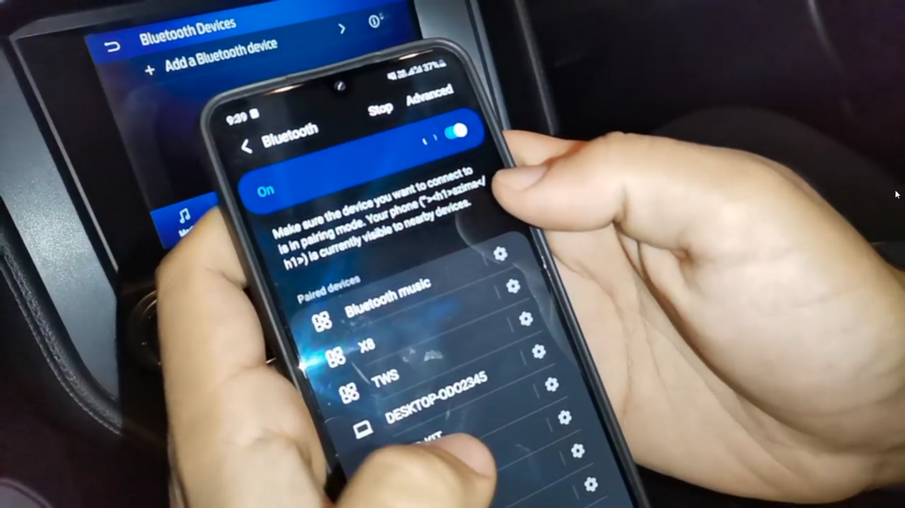
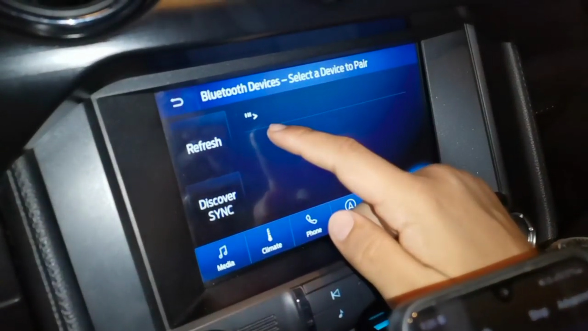
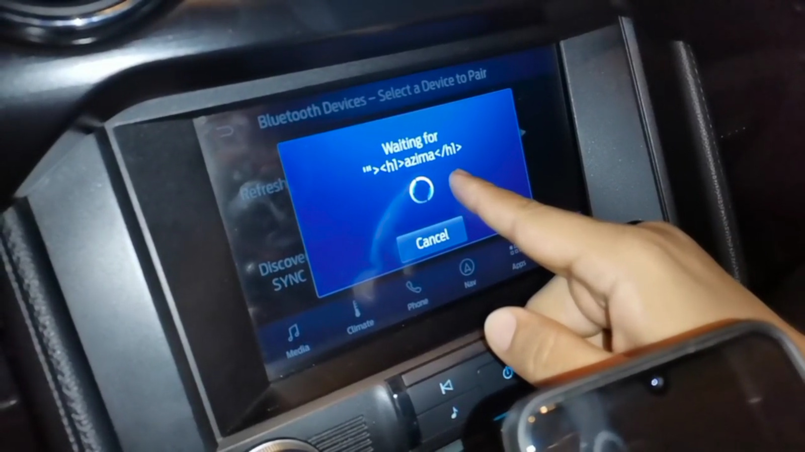
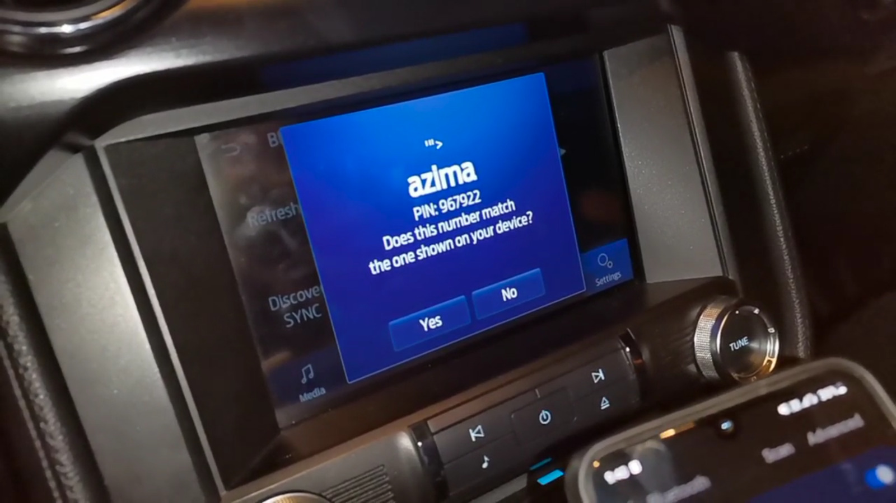
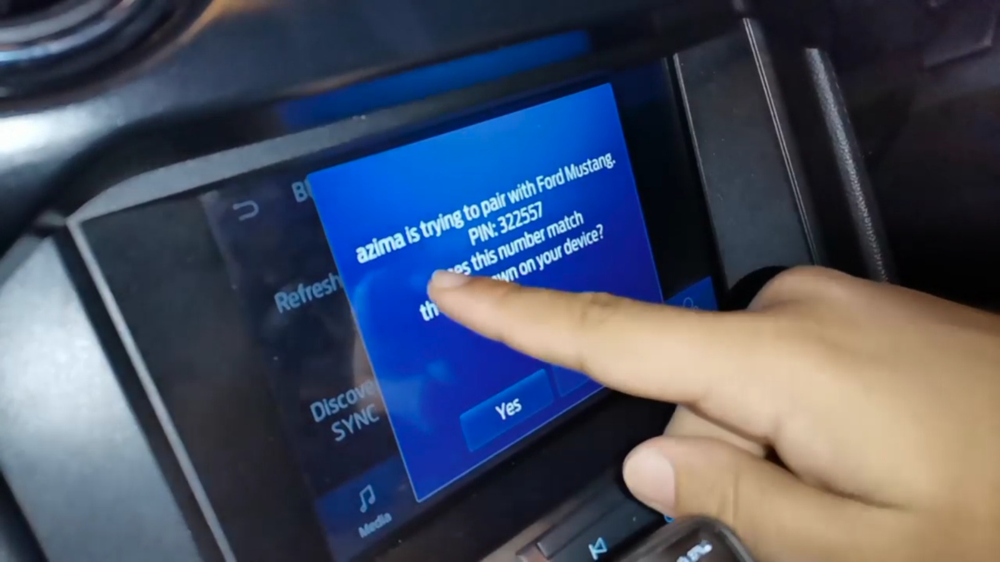

# Reproduce
## Step 1
Rename your device name

## Step 2
Connect to the device in the car panel

## Step 3
 start connection
 
 
 
 ## Step 4
 Code Gets executed
 

# Compare
## Normal connection

## Connection to crafted device name
